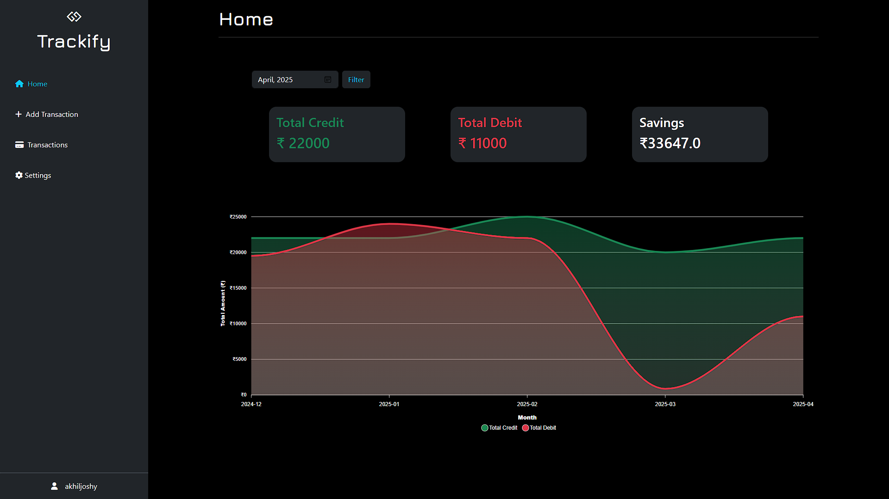
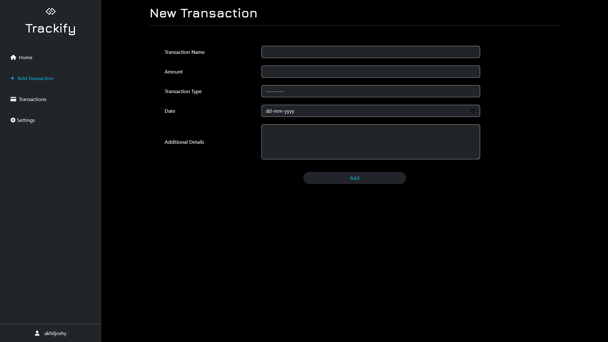

# 📊 Trackify - Expense Tracker App

**Trackify** is a simple and effective personal finance management tool that allows users to track their income and expenses, visualize their monthly savings, and manage transactions with ease.

---

## 🚀 Features

### 🧮 Dashboard
- Visual graphs showing monthly financial data.
- Displays:
  - **Total Credit**
  - **Total Debit**
  - **Net Savings**
- Filter dashboard data by **month**.

### ➕ Add New Transaction
- Create new transactions with:
  - **Name**
  - **Amount**
  - **Transaction Type**: Credit or Debit
  - **Date**
  - **Additional Notes** *(optional)*

### 📂 View All Transactions
- View a complete list of transactions.
- Filter by:
  - **Transaction Type** (Credit/Debit)
  - **Month**

### 🔄 CRUD Operations
- **Create** new transactions
- **Read** and filter transaction history
- **Update** existing entries
- **Delete** transactions

---

## 🛠️ Tech Stack

- **Frontend**: HTML, CSS, Bootstrap (optional)
- **Backend**: Python, Django
- **Database**: SQLite (default Django DB)
- **Data Visualization**: Chart.js or similar (if used)

---

## 📷 Screenshots

### Dashboard

### Add Transation

### Transations

---

